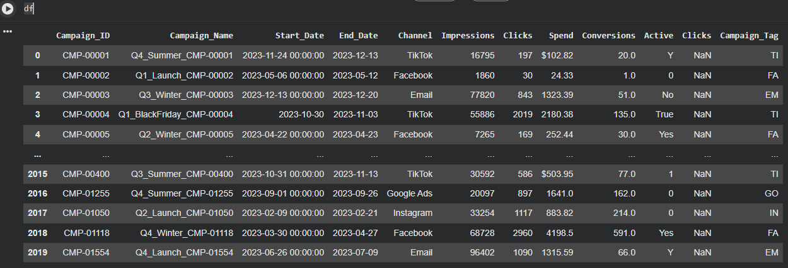

# Marketing Campaign Data Cleaning (Python / Pandas)

Mini portfolio project demonstrating a practical data-cleaning workflow in **Python (Pandas)** using **Google Colab**.  
Goal: take a messy marketing campaign dataset and produce an analysis-ready cleaned output.

## Dataset
- **Raw:** `2,020` rows × `12` columns (`data/raw/marketing_campaign_data_messy.csv`)
- **Clean:** `2,020` rows × `12` columns (`data/clean/marketing_campaign_data_clean.csv`)

## What was cleaned (high-level)
- **Header normalization:** trimmed whitespace, standardized to `snake_case`
- **Duplicate column handling:** removed duplicated `clicks` column in the raw file
- **Currency + type conversion:** stripped `$`/non-numeric characters from `spend` and converted to numeric
- **Categorical standardization:** corrected channel typos (e.g., `Tik_Tok` → `TikTok`, `Facebok` → `Facebook`)
- **Boolean normalization:** mapped mixed values (`Y`, `Yes`, `1`, `0`, `No`, etc.) into `True/False`
- **Date parsing:** converted `start_date` / `end_date` to datetime (invalid values coerced to null)
- **Logical integrity checks:**
  - validated `clicks <= impressions`
  - fixed **34** cases where `end_date < start_date` (set `end_date = start_date + 30 days`)
- **Outlier handling (winsorizing):** capped **6** extreme `spend` values  
  - max spend before: **500,000.00**
  - max spend after: **8,603.54**
- **Feature extraction:** extracted `season` from `campaign_name` (e.g., `Q4_Summer_...` → `Summer`)

## Before vs After (sample)



## Quick data quality notes
- Unique `channel` values reduced from **10** to **6** (including null).
- `active` normalized from **7** mixed values to `[True, False]`.
- `start_date` has **333** invalid/missing values (kept as null rather than imputing).

## How to run
### Run the notebook in Colab

Open: `notebooks/Data_Cleaning_with_Python.ipynb`  
In Colab, upload the raw CSV and run cells top-to-bottom.


## Repo structure
```
notebooks/   # Colab notebook
data/raw/    # messy input CSV
data/clean/  # cleaned output CSV
src/         # optional python script version of the pipeline
assets/      # screenshots used in README
```

## Tech stack
- Python, Pandas, NumPy
